[](https://github.com/TangoMan75/globalis/tags)
[](https://github.com/TangoMan75/globalis/releases)


Globalis
========

Exercice d'algorithmique en pur PHP en _Test Driven Developpement_ (TDD), en respectant les principes de la Programmation Orienté Objet (POO) avec Composer et PHPStorm.

J'ai récemment répondu à une offre pour un poste de **[Développeur PHP confirmé](https://www.globalis-ms.com/jobs/offres-emploi-stage-mission/cdi-developpeur-php-confirme/)** chez [Globalis](https://globalis-ms.com) qui est une ESN Parisienne qui est assez investie dans la communauté PHP, puisqu'ils sont membres de l'[AFUP](https://afup.org/profile/company/169-globalis-media-systems) 👍.

Ils m'ont proposé un test technique sous la forme d'un exercice d'algorithmique dont voici l'énoncé :

Paravent
--------

### Énoncé

Pas de répit pour les Prolosaures ! La mer étant à peine redescendue à son niveau normal, une nouvelle prophétie annonce la venue d'un ouragan.

Des vents violents venus de l'ouest emporteront tout ce qui sera exposé, mais ils seront interceptés par le relief montagneux, derrière lequel les
Prolosaures seront à l'abri de la catastrophe imminente.

Votre but est de déterminer la surface totale protégée par les montagnes.

### Entrée

- La première ligne est un entier n, la largeur du continent.
- La ligne suivante contient n entiers h 1 , ..., h n séparés par des espaces donnant les altitudes du terrain, d'ouest en est.

Le vent arrive de la gauche (de l'ouest) et lorsqu'il rencontre une montagne, toutes les terres qui sont plus à droite et de hauteurs inférieures à celle-ci
sont à l'abri.

Chaque altitude correspond à un terrain d'une unité de surface.

### Sortie

La sortie est un unique entier qui est la surface d'abri disponible.

### Contraintes

- 1 ≤ n ≤ 100 000
- 0 ≤ h ≤ 100 000

### Contraintes d'exécution

| Utilisation mémoire maximum | Temps d'exécution maximum |
|-----------------------------|---------------------------|
| 2000 kilo-octets            | 500 millisecondes         |

### Exemples d'entrée/sortie

> Exemple d'entrée
```
10
30 27 17 42 29 12 14 41 42 42
```

> Exemple de sortie
```
6
```

### Commentaire

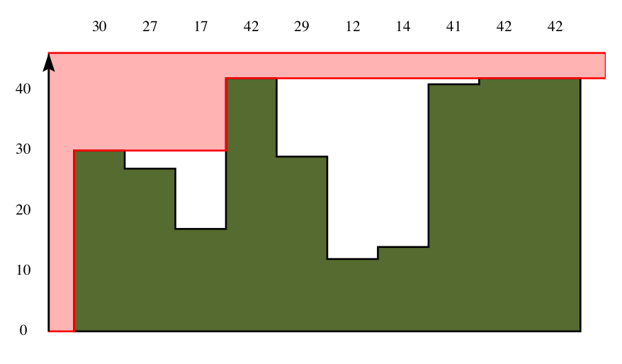

Tout ce qui est dans la zone rouge sera emporté par la tempête.

---

Introduction
------------

Ce petit exercice à l'air bien sympathique, chez Globalis ils ne se sont pas contenté de m'envoyer un test sur [codility](https://www.codility.com), [codingame](https://www.codingame.com) ou [hackerrank](https://www.hackerrank.com), ce que j'apprécie.

Du coup je vais en profiter pour me lancer un _challenge_ perso ; **Je vais réaliser ce test ET écrire un tuto complet du projet étape par étape, SANS utiliser Symfony.**

🏁 Allez, c'est parti mes canards ! 🏁


📝 NOTE : Alors je vais considérer que vous êtes débutant total et partir de zéro, ne vous offusquez pas, mon but est de donner le maximum de détails.

📝 NOTE 2 : J'ai écrit ce tuto en français, mais tous les commentaires dans le code sont en anglais. Ce n'est pas du code que j'ai copié de [Stack Overflow](https://stackoverflow.com) ; C'est fait exprès, on ne devrait **jamais** utiliser autre chose que de l'anglais dans le code.

---

> **TL;DR**
>
> Entrez les commandes suivantes dans votre terminal :
>
> ```bash
> $ git clone https://github.com/TangoMan75/globalis
> $ cd globalis
> $ make install
> $ make tests
> ```

Table des matières
------------------

- [1 ⚡ Environnement de développement](#1--environnement-de-développement)
- [2 ⚡ Création du projet](#2--création-du-projet)
- [3 ⚡ Installation des dépendances du projet](#3--installation-des-dépendances-du-projet)
- [4 ⚡ Commencons à coder](#4--commencons-à-coder)
- [5 ⚡ Mise en place du TDD](#5--mise-en-place-du-tdd)
- [6 ⚡ Solution](#6--solution)
- [⚡ Conclusion](#-conclusion)

1 ⚡ Environnement de développement
-----------------------------------

### 👉 Une parenthèse sur Ubuntu

J'utilise Ubuntu, c'est mon système d'exploitation préféré, il me permet de gagner énormément en productivité. Je vais considérer que vous êtes sur un environnement Linux vous aussi, si vous êtes sur Mac certaines commandes risquent de ne pas fonctionner. Si vous êtes sur Windows 👎, formatez directement votre disque dur et installez la dernière version LTS d'[Ubuntu](https://ubuntu.com/download) on est là pour faire du code, pas pour jouer à _Fortnite_.


### 👉 Installer Make

Si vous étiez en train de jouer à _Fortnite_ et que vous venez donc de formater votre DD ; Vous aurez sûrement besoin de `make` qui n'est pas forcément installé par défaut sur votre système :

```bash
$ sudo apt-get install --assume-yes make
```

### 👉 Installer PHP

Évidemment nous avons besoin d'installer [PHP7.4](https://www.php.net).

```bash
$ sudo apt-get install --assume-yes php7.4
```

Nous n'aurons pas besoin d'extension PHP particulière pour faire fonctionner notre projet.

### 👉 Installer Composer

Composer va nous permettre de gérer les dépendances de notre projet.

```bash
# download latest stable composer.phar
$ php -r "copy('https://getcomposer.org/composer-stable.phar', 'composer.phar');"
# install composer globally
$ sudo mv composer.phar /usr/local/bin/composer
# fix permissions
$ sudo chmod uga+x /usr/local/bin/composer
$ sync
$ composer clear-cache
```

### 👉 En option : vim

_vim_ est un éditeur de texte en ligne de commande, c'est [ma préférence à moi](https://www.youtube.com/watch?v=1hjPwWfvXh4) pour les `git rebase` interactifs (mais il n'y a vraiment pas d'obligation si vous préférez utiliser _nano_).

```bash
$ sudo apt-get install --assume-yes vim
# set vim as git default editor if installed
$ git config --global core.editor 'vim'
```

> L'ASTUCE DU CHEF :
>
> Pour quitter vim il faut simplement entrer:
>
> <kbd>:</kbd><kbd>q</kbd><kbd>!</kbd>
>
> Pour enregistrer un fichier et quitter:
>
> <kbd>:</kbd><kbd>w</kbd><kbd>q</kbd><kbd>!</kbd>

### 👉 Installer git

Git est l'outil indispensable pour versionner notre code, pour l'installer entrez cette commande dans votre terminal :

```bash
$ sudo apt-get install --assume-yes git
```

Et pour la configuration de base :

```bash
# default git config
$ git config --global push.default simple
# set git to use the credential memory cache
$ git config --global credential.helper cache
# set the cache to timeout after 1 hour (setting is in seconds)
$ git config --global credential.helper 'cache --timeout=3600'
# set vim as git default editor if installed
$ git config --global core.editor 'vim'
# set your username and email
$ git config --replace-all --global user.name "Votre nom"
$ git config --replace-all --global user.email "Votre email"
```

### 👉 En option : github-cli

Il n'est pas absolument indispensable, mais le client de [github](https://github.com) permet de se connecter à son compte et de créer des dépôts en ligne de commande.

```bash
$ wget https://github.com/cli/cli/releases/download/v1.7.0/gh_1.6.1_linux_amd64.tar.gz
# extract archive
$ tar xvzf gh_1.7.0_linux_amd64.tar.gz
# install globally
$ sudo mv ./gh_1.7.0_linux_amd64/bin/gh /usr/local/bin/gh
# fix permissions
$ sudo chmod uga+x /usr/local/bin/gh
$ rm -rf gh_1.7.0_linux_amd64
$ rm -f gh_1.7.0_linux_amd64.tar.gz
$ sync
```

### 👉 Installer le meilleur IDE de l'univers

L'excellent [PHPStorm](https://www.jetbrains.com/fr-fr/phpstorm) est pour moi vraiment le meilleur outil pour coder en PHP il n'y a pas photo.

```bash
$ sudo snap install phpstorm --classic
```

> 📝 NOTE : Il est payant, mais JetBrains offre 30 jours d'essai gratuit, ensuite il faudra mettre la main à la poche ou vous contenter de [Sublime Text](https://www.sublimetext.com) qui n'est pas gratuit non plus, mais qui au lieu d'expirer va juste vous envoyer des notifications de temps en temps, (non, je ne vais pas aller jusqu'à vous recommander d'utiliser _vim_).

---

Voilà, c'est tous les outils dont nous aurons besoin pour ce projet. Passons à la suite.

2 ⚡ Création du projet
-----------------------

Pour initialiser notre projet nous avons juste besoin de quelques commandes.

### 👉 Initialisation du dépôt git

Maintenant, nous allons créer un nouveau dépôt ; Si vous êtes comme moi et que vous kiffez la ligne de commande, avec github-cli:

```bash
$ gh auth login
$ gh repo create globalis
```
Répondez _Yes_ aux deux questions. 👍

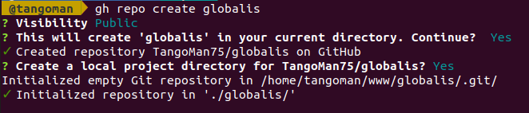

Sinon dans votre navigateur créez un nouveau dépôt [https://github.com/new](https://github.com/new), puis clonez simplement le dépôt que vous venez de créer.

```bash
$ git clone https://gihub.com/VotreNomDUtilisateur/globalis
```

### 👉 Initialisation du projet avec Composer

Tout d'abord il faut créer un nouveau projet avec composer, changez de dossier courant avec `cd globalis` et entrez la commande suivante :

```bash
$ composer init
```

Répondez aux questions de l'assistant :

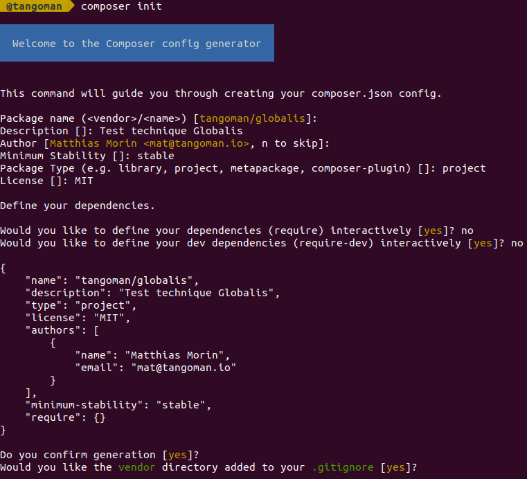

3 ⚡ Installation des dépendances du projet
-------------------------------------------

### 👉 Installation de PHP

Nous allons utiliser php7.4

```bash
$ composer require php
```

Nous allons modifier le critère de `composer.json` pour qu'il accepte toutes les versions de PHP supérieures à la 7.4.

[./composer.json](./composer.json)
```json
    "require": {
        "php": ">=7.4"
    },
```

C'est juste un détail mais ça va être utile pour la _pipeline_ d'intégration continue (à un moment donné sera obligé de passer à la version 8 de PHP, il faut bien s'y préparer). Nous allons utiliser [GitHub Actions](https://github.com/features/actions), nous verrons ça plus tard.

### 👉 Installation de _PHPUnit_

Et nous allons avoir besoin de _PHPUnit_ pour tester notre code.

Oui, oui, oui, nous allons faire du _"TDD"_, tout à fait.


```bash
$ composer require --dev phpunit/phpunit
```

Et ajoutons la config qui va bien, dans le fichier `phpunit.xml.dist`:

[./phpunit.xml.dist](./phpunit.xml.dist)
```xml
<?xml version="1.0" encoding="UTF-8"?>
<!-- https://phpunit.readthedocs.io/en/latest/configuration.html -->
<phpunit xmlns:xsi="http://www.w3.org/2001/XMLSchema-instance"
         xsi:noNamespaceSchemaLocation="vendor/phpunit/phpunit/phpunit.xsd"
         convertDeprecationsToExceptions="true"
         convertErrorsToExceptions="true"
         convertNoticesToExceptions="true"
         convertWarningsToExceptions="true"
         colors="true"
>
    <testsuites>
        <testsuite name="unit">
            <directory>tests/Unit</directory>
        </testsuite>
    </testsuites>
</phpunit>
```

### 👉 Installation de _PHP_Codesniffer_

Ce n'est pas indispensable mais nous allons aussi installer `php_codesniffer` pour _linter_ notre code:

```bash
$ composer require --dev squizlabs/php_codesniffer
```

Ajoutez cette config dans le fichier `phpcs.xml.dist`:

[./phpcs.xml.dist](./phpcs.xml.dist)
```xml
<?xml version="1.0" encoding="UTF-8"?>

<ruleset xmlns:xsi="http://www.w3.org/2001/XMLSchema-instance"
         xsi:noNamespaceSchemaLocation="vendor/squizlabs/php_codesniffer/phpcs.xsd">

    <!-- Documentation: https://github.com/squizlabs/PHP_CodeSniffer -->

    <arg name="basepath" value="."/>
    <arg name="cache" value=".phpcs-cache"/>
    <arg name="colors"/>
    <arg name="extensions" value="php"/>

    <file>src/</file>
    <file>tests/</file>

    <rule ref="PSR12" />

    <rule ref="Generic.PHP.RequireStrictTypes.MissingDeclaration" />
    <rule ref="Generic.Arrays.DisallowLongArraySyntax"/>

</ruleset>
```

### 👉 .gitignore

N'oublions pas de `.gitignore` les fichiers de cache de _phpunit_ et _phpcs_:

```
/vendor/
.phpcs-cache
.phpunit.result.cache
composer.lock
```

On va aussi ignorer `composer.lock` pour éviter des problèmes de compatibilités dans la _pipeline_ de _CI/CD_ (nous allons tester avec **PHP7 ET PHP8** du coup c'est mieux si le _builder_ de _GitHub_ ne se base pas sur le `.lock` pour installer notre script).

### 👉 _Pipeline_ d'intégration continue

L'intégration continue nous permet d'automatiser un certain nombre de tâches.
Par exemple nous voulons vérifier que les tests unitaires passent et que le _linter_ ne retourne pas d'erreurs.

Pour mettre en place la configuration de _GitHub workflow_ créez les dossiers `.github/workflows`

```bash
$ mkdir -p .github/workflows
```

Et copiez-y le fichier `php.yaml` suivant :

[./.github/workflows/php.yaml](./.github/workflows/php.yaml)
```yaml
name: PHP CI
on:
  push:
    branches: [ master ]
  pull_request:
    branches: [ master ]

jobs:
  php:
    name: PHP project (PHP ${{ matrix.php-versions }})

    runs-on: ubuntu-latest
    if: "! contains(toJSON(github.event.commits.*.message), '[skip ci]')"

    strategy:
      fail-fast: true
      matrix:
        php-versions: ['7.4', '8.0']

    steps:
      # Setup Github actions
      # https://github.com/actions/checkout (official)
      - name: Checkout
        uses: actions/checkout@v2

      # Setup PHP
      # https://github.com/shivammathur/setup-php (community)
      - name: Setup PHP, extensions and composer with shivammathur/setup-php
        uses: shivammathur/setup-php@v2
        with:
          php-version: ${{ matrix.php-versions }}
          tools: composer

      - name: Install Project
        run: make install

      - name: Check for code quality errors
        run: make lint

      - name: Run Unit tests
        run: make tests
```

Copiez également le fichier `Makefile` à la racine de votre projet : [https://raw.githubusercontent.com/TangoMan75/globalis/master/Makefile](https://raw.githubusercontent.com/TangoMan75/globalis/master/Makefile)

Ils contiennent les scripts à tonton qui permettent de gérer tout ça.
Je ne vais pas m'étendre là dessus puisque ce n'est pas le sujet de ce tuto.
Sachez juste que le script affiche sa propre documentation en tapant cette commande dans votre terminal :

```bash
$ make
```

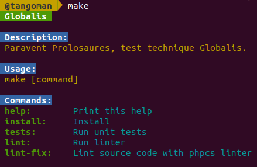

### 👉 Vérifions que tout est en ordre

```bash
$ cat composer.json
```

Si tout s'est passé comme prévu, à cette étape le fichier `composer.json` (qui liste les dépendances installées dans le dossier `./vendor`) devrait contenir ceci :

[./composer.json](./composer.json)
```json
{
    "name": "tangoman/globalis",
    "description": "Test technique Globalis",
    "type": "project",
    "license": "MIT",
    "authors": [
        {
            "name": "Matthias Morin",
            "email": "mat@tangoman.io"
        }
    ],
    "minimum-stability": "stable",
    "require": {
        "php": ">=7.4"
    },
    "require-dev": {
        "phpunit/phpunit": "^9.5",
        "squizlabs/php_codesniffer": "^3.5"
    }
}
```

### 👉 Faisons une petite sauvegarde de notre travail

```bash
$ git add .
$ git commit -m "Initial Commit"
$ git push
```


À cette étape si vous avez suivi à la lettre toutes mes instructions vous devriez recevoir un mail de la part de _GitHub_ qui vous prévient que la pipeline de ci à échoué, c'est tout fait normal... Nous n'avons pas encore écrit la moindre ligne de code.

4 ⚡ Commençons à coder
-----------------------

### 👉 Création de l'objet _Continent_

Nous allons mettre le script principal dans le dossier `./src/Continent`:

```bash
$ mkdir -p ./src/Continent
```

Ouvrez le projet avec _PHPStorm_, puis faites un clic droit sur le dossier `Continent` et ensuite `new > PHP Class`. Nous allons nommer cette classe "Continent", on ne va pas se casser la tête.


### 👉 Création des propriétés de l'objet _Continent_

Nous avons besoin de deux propriétés dans le fichier `Continent.php` que nous venons de créer:

[./scr/Continent/Continent.php](./scr/Continent/Continent.php)
```php
    // ...

    /**
     * @var int Continent width
     */
    private int $width;

    /**
     * @var array Array representing terrain heights
     */
    private array $terrain;

    // ...
```

📝 NOTE : Nous somme en PHP 7.4, n'oubliez pas de _typer_ les propriétés de l'objet.

La première propriété représente la largeur du continent (de type entier), la seconde représente le terrain (de type tableau. Oui, oui, vous avez bien vu nous voulons bien un `array`, pas une _chaîne de caractères_).

### 👉 Création du constructeur

Maintenant faites <kbd>alt</kbd>+<kbd>ins</kbd> pour faire apparaître le menu _Generate..._ de _PHPStorm_.

Cliquez sur _Constructor..._, selectionnez les deux propriétés et cliquez sur _OK_.

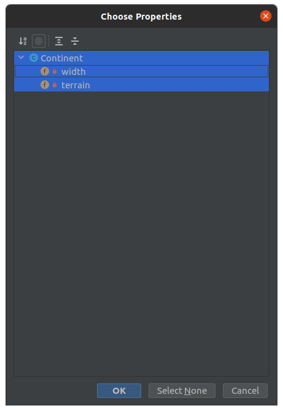

Et voilà ! _PHPStorm_ a généré le _constructeur_ et a initialisé les _propriétés_ de l'objet automatiquement ! Super ! 🤟

Nous allons passer les paramètres pour créer le continent des _prolosaures_ directement dans le _constructeur_.

> C'est un continent ; à priori il ne va pas changer de taille tous les jours... Et le profil du terrain ne devrait pas changer non plus... En tout cas probablement pas pendant l'exécution de notre calcul.

Le constructeur de notre classe par contre **doit accepter une _chaîne de caractères_ pour la variable "terrain"**, le plan c'est de transformer ensuite cette valeur en tableau.

[./src/Continent/Continent.php](./src/Continent/Continent.php)
```php
    // ...

    public function __construct(int $width, string $terrain)
    {

    // ...
```

### 👉 Création des _setters_

Faites à nouveau <kbd>alt</kbd>+<kbd>ins</kbd>, cette fois ci séléctionnez _Setters..._

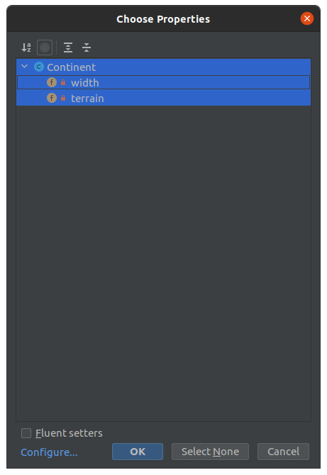

Nous allons les modifier de sorte qu'ils permettent de convertir et de valider les entrées que nous allons leur passer.

Ces méthodes ne **doivent pas** être accessibles depuis l'extérieur de la classe `Continent`, nous les passons en `private`.

Nous allons juste apporter une petite modification à la méthode `getTerrain` pour qu'elle accepte un paramètre de type `string`.

[./src/Continent/Continent.php](./src/Continent/Continent.php)
```php
    // ...

    /**
     * This method will convert string to array and validate value.
     *
     * @param string $terrain
     */
    private function setTerrain(string $terrain): void
    {

    // ...
```

Laissons ça de côté pour l'instant, nous reviendrons dessus un peu plus tard.

Dans le constructeur maintenant nous allons utiliser les _setters_ que nous venons de créer au lieu de définir les valeurs directement.

[./src/Continent/Continent.php](./src/Continent/Continent.php)
```php
    // ...

    public function __construct(int $width, string $terrain)
    {
        $this->setWidth($width);
        $this->setTerrain($terrain);
    }

    // ...
```

### 👉 Création de la méthode `getSafeArea`

C'est la méthode qui va nous permettre de calculer l'aire de la zone dans laquelle les _prolosaures_ sont à l'abri du vent.

[./src/Continent/Continent.php](./src/Continent/Continent.php)
```php
    // ...

    /**
     * This method computes the area where prolosaurs are safe.
     *
     * @return int
     */
    public function getSafeArea(): int
    {
        return 1;
    }

    // ...
```

Pour le moment elle ne va retourner que le chiffre _1_.

---

Bien ! Nous avons terminé avec cette première partie. Je vous ai promis du **TDD** alors à partir de maintenant écrivons nos tests.

5 ⚡ Mise en place du TDD
-------------------------

### 👉 Création des tests unitaires

Comme les fois précédentes dans le menu _Generate..._ cette fois-ci sélectionnez _Test..._

Sélectionnez la méthode `getSafeArea` uniquement et cliquez sur _OK_.

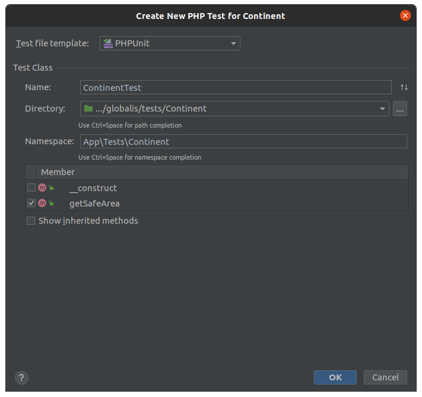

🎉 Youpi ! _PHPStorm_ à créé notre fichier de test automatiquement ! 🎉

[./tests/Continent/ContinentTest.php](./tests/Continent/ContinentTessmall)
```php
<?php

namespace App\Tests\Continent;

use App\Continent\Continent;
use PHPUnit\Framework\TestCase;

class ContinentTest extends TestCase
{

    public function testGetSafeArea()
    {

    }
}
```

Bon, pour le moment il est vide, mais on va s'en occuper tout de suite !!!

### 👉 Tester la validation des paramètres

La première chose à faire est de tester que les arguments que nous passons dans le constructeur sont correctement validés, c'est-à-dire qu'ils vont déclencher une erreur s'ils ne respectent pas un certain nombre de contraintes.

- L'énoncé nous précise que la largeur du continent ne peut pas être plus petit que _1_ et ne peut pas être plus grand que _100000_;

> Ce sont des unités arbitraires, à l'époque j'imagine que les dinosaures mesuraient les distances en "kilo-griffes", ou en "bras de T-Rex" pour les distances plus courtes.


- Il est précisé également que le terrain ne peut contenir que des hauteurs entre _0_ et _100000_.

- Et aussi, logiquement notre objet devrait faire péter une erreur si nous essayons de créer un continent qui ne peut pas contenir tous les éléments du terrain.

### 👉 Tester `setWidth`

Nous voudrions voir apparaitre le message _'Width cannot be lower than 1 ; "X" given'_ quand nous passons un nombre inférieur à un pour la largeur du continent.

Et le message _'Width cannot be greater than 100000 ; "X" given'_ quand nous passons un nombre supérieur à cent mille.

Écrivons les tests correspondants :

[./tests/Continent/ContinentTest.php](./tests/Continent/ContinentTessmall)
```php

    // ...

    public function testSmallWidthShouldRaiseInvalidArgumentException()
    {
        $this->expectException(\InvalidArgumentException::class);

        $this->expectExceptionMessage('Width cannot be lower than 1 ; "0" given');

        new Continent(0, '1');
    }

    public function testLargeWidthShouldRaiseInvalidArgumentException()
    {
        $this->expectException(\InvalidArgumentException::class);

        $this->expectExceptionMessage('Width cannot be greater than 100000 ; "100001" given');

        new Continent(100001, '1');
    }

    // ...
```

Maintenant, si vous lancez le test vous devriez voir une belle erreur :

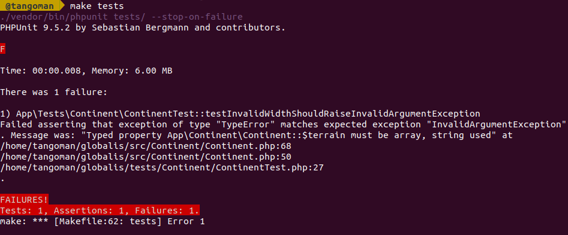

Parfait, c'est exactement ce que nous voulons.

### 👉 Implémenter `setWidth`

Revenons maintenant dans la méthode `setWidth` de l'objet `Continent`.
La consigne nous indique que la largeur du continent doit être au moins égale à un, et ne pas dépasser _100000_ au maximum.

Créons donc deux constantes de classe comme ceci :

[./src/Continent/Continent.php](./src/Continent/Continent.php)
```php

    // ...

    public const DEFAULT_MIN_WIDTH = 1;
    public const DEFAULT_MAX_WIDTH = 100000;

    // ...
```

Puis dans la méthode `setWidth` nous allons générer une erreur quand l'_argument_ `$width` est inférieur à _1_ avec un joli message :

[./src/Continent/Continent.php](./src/Continent/Continent.php)
```php

        // ...

        if ($width < 1) {
            throw new \InvalidArgumentException(
                sprintf(
                    'Width cannot be lower than %s ; "%s" given',
                    self::DEFAULT_MIN_WIDTH,
                    $width
                )
            );
        }

        // ...
```

La même chose quand l'_argument_ `$width` est supérieur à _100000_ avec le message correspondant :

[./src/Continent/Continent.php](./src/Continent/Continent.php)
```php

        // ...

        if ($width > 100000) {
            throw new \InvalidArgumentException(
                sprintf(
                    'Width cannot be greater than %s ; "%s" given',
                    self::DEFAULT_MAX_WIDTH,
                    $width
                )
            );
        }

        // ...
```

Si la variable est validée, la méthode va `setter` la valeur.

[./src/Continent/Continent.php](./src/Continent/Continent.php)
```php
        // ...

        $this->width = $width;
    }

    // ...
```

Maintenant essayons de voir si nos tests passent :

```bash
$ make tests
```

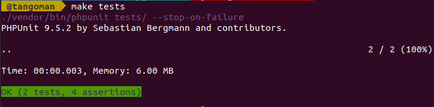

🎉 YEAH ! ÇA MARCHE !! 🎉


### 👉 Tester `setTerrain`

Notre objet doit lever une exception si nous essayons de créer un continent qui ne peut pas contenir tous les éléments de notre terrain. Écrivons le test correspondant :

[./tests/Continent/ContinentTest.php](./tests/Continent/ContinentTessmall)
```php

    // ...

    public function testInvalidTerrainShouldRaiseInvalidArgumentException()
    {
        $this->expectException(\InvalidArgumentException::class);

        $this->expectExceptionMessage('Terrain cannot be wider that continent');

        new Continent(1, '1 2');
    }

    // ...
```

### 👉 Implémenter `setTerrain`

Commençons par créer deux constantes de classe comme précédemment, avec les valeurs correspondantes :

La hauteur du terrain ne peut pas être négative, et ne pas dépasser _100000_ au maximum.

[./src/Continent/Continent.php](./src/Continent/Continent.php)
```php

    // ...

    public const DEFAULT_MIN_HEIGHT = 0;
    public const DEFAULT_MAX_HEIGHT = 100000;

    // ...
```

N'oublions pas que notre méthode reçoit une _chaîne de caractères_ en entrée, nous devons d'abord la convertir en tableau avec la fonction `explode`. Elle va être découpée à chaque espace.

[./src/Continent/Continent.php](./src/Continent/Continent.php)
```php

    // ...

    private function setTerrain(string $terrain): void
    {
        // Split string to array
        $terrain = explode(' ', $terrain);

        if (\count($terrain) > $this->width) {
            throw new \InvalidArgumentException('Terrain cannot be wider that continent');
        }

        // ...
```

Vous commencez à connaître la routine maintenant.


Lancez les tests, ça devrait passer !

```bash
$ make tests
```

### 👉 Hauteur minimale et maximale dans `setTerrain` : Tests

D'abord, que se passerait-il si notre `string` contenait des caractères alphabétiques ? Dans ce cas, on préfère que la méthode `setTerrain` nous retourne une erreur propre. Parce qu'on n'est pas des sauvages.

[./tests/Continent/ContinentTest.php](./tests/Continent/ContinentTessmall)
```php

    // ...

    public function testInvalidHeightShouldRaiseInvalidArgumentException()
    {
        $this->expectException(\InvalidArgumentException::class);

        $this->expectExceptionMessage('Invalid Height ; "foobar" given');

        new Continent(1, 'foobar');
    }

    // ...
```

Continuons, la consigne dit que toutes les hauteurs du terrain doivent être supérieures à zéro, et ne pas dépasser _100000_ au maximum.

[./tests/Continent/ContinentTest.php](./tests/Continent/ContinentTessmall)
```php

    // ...

    public function testNegativeHeightShouldRaiseInvalidArgumentException()
    {
        $this->expectException(\InvalidArgumentException::class);

        $this->expectExceptionMessage('Height cannot be lower than 0 ; "-1" given');

        new Continent(1, '-1');
    }

    public function testLargeHeightShouldRaiseInvalidArgumentException()
    {
        $this->expectException(\InvalidArgumentException::class);

        $this->expectExceptionMessage('Height cannot be greater than 100000 ; "100001" given');

        new Continent(1, '100001');
    }

    // ...
```

### 👉 Hauteur minimale et maximale : Implémentation

La première chose à faire c'est utiliser la fonction `is_numeric` pour tester que notre `string` ne contient que des nombres.

[./src/Continent/Continent.php](./src/Continent/Continent.php)
```php

        // ...

        foreach ($terrain as $height) {
            if (! is_numeric($height)) {
                throw new \InvalidArgumentException(
                    sprintf(
                        'Invalid Height ; "%s" given',
                        $height
                    )
                );
            }

            // ...
```

Ensuite nous allons _checker_ que la variable est un nombre entre 1 et 100000.

[./src/Continent/Continent.php](./src/Continent/Continent.php)
```php
            // ...

            if ($height < 1) {
                throw new \InvalidArgumentException(
                    sprintf(
                        'Height cannot be lower than %s ; "%s" given',
                        self::DEFAULT_MIN_HEIGHT,
                        $height
                    )
                );
            }

            if ($height > 100000) {
                throw new \InvalidArgumentException(
                    sprintf(
                        'Height cannot be greater than %s ; "%s" given',
                        self::DEFAULT_MAX_HEIGHT,
                        $height
                    )
                );
            }

            // ...
```

Quand tout s'est bien passé la méthode va `setter` la valeur qui vient d'être validée.

[./src/Continent/Continent.php](./src/Continent/Continent.php)
```php
        // ...

        $this->terrain = $terrain;
    }

    // ...
```

Lancez les tests :
```bash
$ make tests
```

Ça passe ! Pouêt ! 🎉

6 ⚡ Solution
-------------

### 👉 Création du test de `getSafeArea`

Utilisons l'exemple donné dans la consigne, l'algorithme devrait nous retourner le nombre _88_. (Non, non, non, je n'ai pas triché je l'ai bel et bien calculé de tête... Oui je sais, c'est impressionnant.)

> On reproche souvent aux développeurs PHP d'être arrogants, mais c'est franchement pas si facile de rester modeste quand on maîtrise les additions et les soustractions... Hé ouais...

[./tests/Continent/ContinentTest.php](./tests/Continent/ContinentTessmall)
```php

    // ...

    public function testGetSafeArea()
    {
        $continent = new Continent(10, '30 27 17 42 29 12 14 41 42 42');

        $this->assertEquals(88, $continent->getSafeArea());
    }
}
```

### 👉 Implémentation de la logique de l'algorithme principal

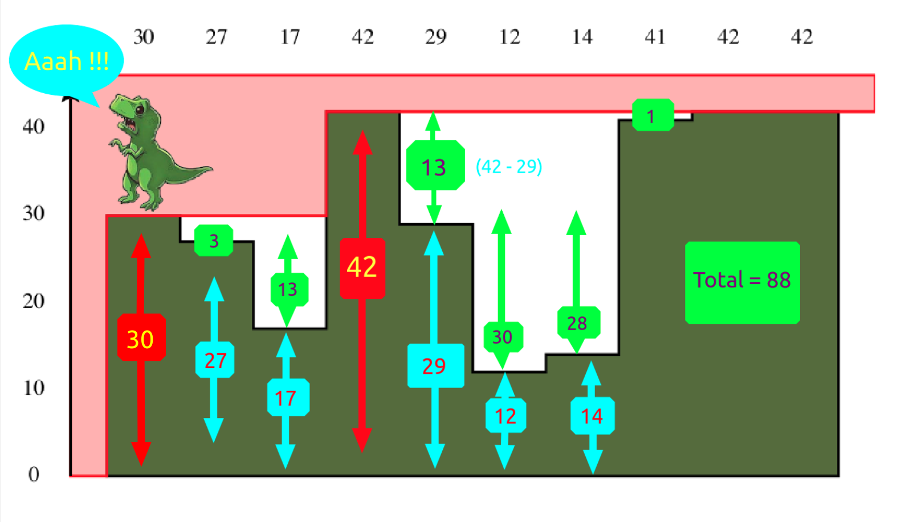

1. On parcourt la liste des hauteurs du terrain une par une.
2. Quand le continent est plus grand que le terrain, on considère que la hauteur est égale à zéro pour les valeurs manquantes.
3. On enregistre dans une variable la hauteur la plus élevée que nous avons rencontrée jusqu'à présent.
4. Si la hauteur de terrain courante est inférieure à la hauteur la plus haute rencontrée précédemment, on ajoute au résultat la différence entre la hauteur la plus élevée et la hauteur courante.

[./src/Continent/Continent.php](./src/Continent/Continent.php)
```php

    // ...

    /**
     * This method computes the area where prolosaurs are safe.
     *
     * @return int
     */
    public function getSafeArea(): int
    {
        $area = 0;
        $highest = 0;

        // [1] Iterate through all continent
        for ($i = 0; $i < $this->width; ++$i) {
            // [2] Handle case where list shorter than continent
            $height = $this->terrain[$i] ?? 0;

            if ($height > $highest) {
                // [3] Prolosaurs on this terrain are vulnerable
                $highest = $height;
            } else {
                // [4] Prolosaurs on this terrain are protected from wind
                $area += $highest - $height;
            }
        }

        return $area;
    }
}
```

### 👉 Testons

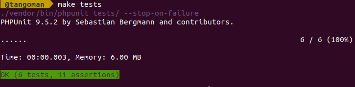

🎉 **C'EST UN SUCCÈS !** 🎉


Alors évidemment, vous allez me dire qu'on a consommé plus que 2000 kilo-octets de ram.
Mais c'est _PHPUnit_ qui utilise cette mémoire pour l'essentiel, l'algorithme lui-même consomme très peu en fait.
On parcourt le tableau des hauteurs du terrain une seule fois, la complexité est donc linéaire.

Si vous êtes familier avec la notation _Big O_ nous sommes en `O(n)`, donc je crois que nous pouvons dire que le challenge est réussi. 😉

⚡ Conclusion
-------------

Et voilà, cette victoire sonne la fin de cette petite aventure !

Et si vous avez suivi jusque-là, **félicitations à vous aussi les amis !**


J'espère que vous avez pris goût à la POO, le TDD, Linux, et PHP !

Pour me contacter :

[](mailto:mat@tangoman.io)
[](https://tangoman.io)
[](https://github.com/TangoMan75)
[](https://linkedin.com/in/matthiasmorin)
[](https://twitter.com/tangomanparis)

🤝 Contribuer
-------------

Merci pour votre intérêt à apporter votre contribution à **Globalis**.

Veuillez consulter le [code de conduite](./CODE_OF_CONDUCT.md) et les [directives de contribution](./CONTRIBUTING.md) avant de commencer à travailler sur des fonctionnalités.

Si vous souhaitez ouvrir un rapport de bug, veuillez d'abord vérifier qu'il n'a pas [déjà été signalé](https://github.com/TangoMan75/globalis/issues) avant d'en créer un nouveau.

📜 License
----------

Copyrights (c) 2021 &quot;Matthias Morin&quot; &lt;mat@tangoman.io&gt;

[](LICENSE)
Distribué sous la licence MIT.

Si vous aimez **Globalis**, mettez une étoile, suivez-moi ou publiez un tweet.

[](https://github.com/TangoMan75/globalis/stargazers)
[](https://github.com/TangoMan75)
[](https://twitter.com/intent/tweet?text=Wow:&url=https%3A%2F%2Fgithub.com%2FTangoMan75%2Fglobalis)

... Et jetez un oeil à mes autres projets.

🙏 Remerciements
----------------

Ce script a été généré avec [makefile-generator](https://github.com/TangoMan75/makefile-generator)
